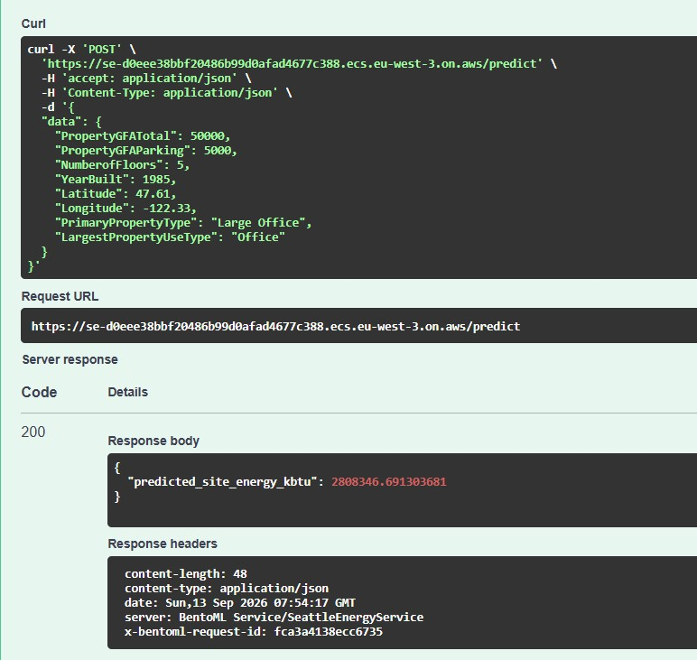
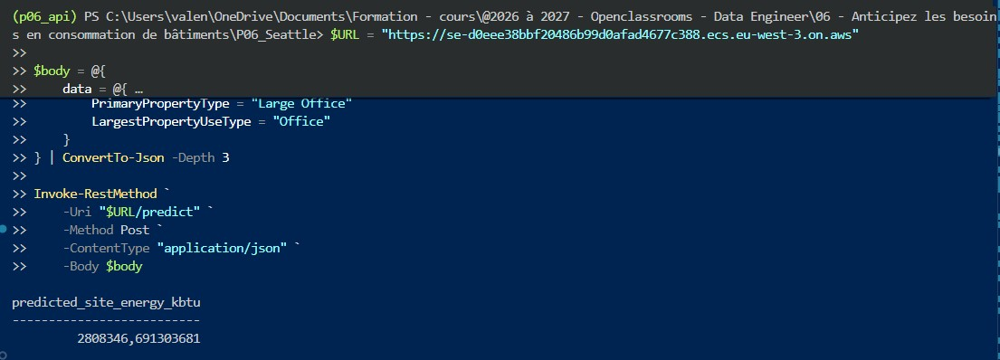
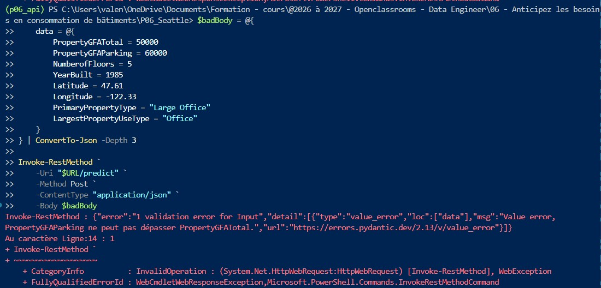
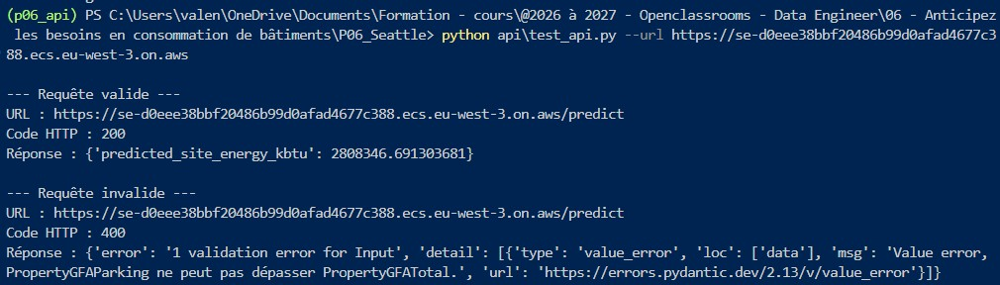

# Anticipez les besoins en consommation de bâtiments

Projet réalisé dans le cadre de la formation Data Engineer d'OpenClassrooms.

## Présentation du projet

La ville de Seattle souhaite atteindre la neutralité carbone à l'horizon 2050.
Dans ce contexte, l'objectif du projet est d'exploiter les données de consommation
et les caractéristiques structurelles de bâtiments non résidentiels afin de prédire
leur consommation énergétique annuelle.

Le projet est organisé en deux grandes étapes :

1. **Modélisation supervisée**
   - préparation et exploration des données ;
   - création et sélection des variables ;
   - comparaison de plusieurs modèles de régression ;
   - optimisation et évaluation du modèle retenu sur un jeu de test.

2. **Mise à disposition du modèle**
   - sauvegarde du pipeline de prédiction avec BentoML ;
   - création d'une API de prédiction avec validation des données d'entrée ;
   - conteneurisation de l'application avec Docker ;
   - déploiement de l'image sur AWS ;
   - validation de l'API à travers des requêtes locales et distantes.

## Données

Le projet utilise le jeu de données **2016 Building Energy Benchmarking**
de la ville de Seattle.

La variable cible du modèle est :

`SiteEnergyUse(kBtu)`

Elle représente la consommation énergétique annuelle totale du bâtiment,
exprimée en kBtu.

Le modèle est destiné aux **bâtiments non résidentiels** et utilise uniquement
des informations disponibles à partir des caractéristiques du bâtiment, sans
recourir directement aux relevés de consommation énergétique à prédire.

Après restriction aux bâtiments non résidentiels, le jeu contient **1 668 bâtiments**.

Un contrôle qualité est ensuite appliqué à partir des variables fournies dans le jeu de données :

- seuls les bâtiments dont `ComplianceStatus == "Compliant"` sont conservés ;
- les observations signalées dans la variable `Outlier` sont exclues.

Après ce filtrage, **1 548 bâtiments** sont retenus pour l'analyse et la modélisation.

## Structure du projet

```text
P06_Seattle/
│
├── Modelisation.ipynb
├── README.md
├── bentofile.yaml
│
├── api/
│   ├── schemas.py
│   ├── service.py
│   └── test_api.py
│
├── data/
│   └── 2016_Building_Energy_Benchmarking.csv
│
└── docs/
    ├── cloud-test-output.txt
    └── screenshots/
        ├── api-aws-interface.jpg
        ├── api-aws-prediction-200.jpg
        ├── api-aws-validation-400.jpg
        └── cloud-test-output.jpg
```

Rôle des principaux fichiers
- Modelisation.ipynb : préparation des données, feature engineering,
comparaison des modèles, optimisation, évaluation et sélection du pipeline
de prédiction final.
- api/schemas.py : définition et validation des données d'entrée et de
sortie de l'API avec Pydantic.
- api/service.py : service BentoML chargé d'effectuer les transformations
nécessaires puis d'appeler le pipeline de prédiction.
- api/test_api.py : tests de l'endpoint de prédiction à partir de requêtes
HTTP.
- bentofile.yaml : configuration utilisée pour construire le Bento et
déclarer le service, le modèle et les dépendances nécessaires.
- data/ : jeu de données source utilisé pour la modélisation.
- **`docs/`** : preuves conservées des tests du service déployé sur AWS,
  incluant les captures d'écran et la sortie du test distant exécuté depuis
  le terminal.

## Modélisation et modèle retenu

Plusieurs algorithmes de régression ont été comparés selon un protocole commun reposant sur une séparation train/test, un pipeline de prétraitement identique et une validation croisée à 5 folds sur le jeu d'entraînement.

Quatre modèles supervisés appartenant à trois familles différentes ont été évalués :

- `LinearRegression` : modèle linéaire ;
- `SVR` : famille des Support Vector Machines ;
- `DecisionTreeRegressor` : modèle à base d'arbre ;
- `RandomForestRegressor` : ensemble d'arbres.

Un `DummyRegressor` est également utilisé comme baseline de référence.

Tous les modèles sont comparés selon les mêmes métriques : MAE, RMSE et R².

| Modèle | MAE CV | RMSE CV | R² CV |
| --- | ---: | ---: | ---: |
| Random Forest | 3,74 M | 11,31 M | 0,594 |
| Régression linéaire | 4,71 M | 14,43 M | 0,285 |
| Arbre de décision | 5,16 M | 15,34 M | 0,166 |
| Dummy Regressor | 8,38 M | 19,14 M | ≈ 0 |
| SVR | 6,64 M | 19,80 M | -0,082 |

Le **Random Forest** présente les meilleures performances moyennes en validation croisée. Il est donc retenu pour l'optimisation.

Une recherche d'hyperparamètres avec `GridSearchCV` a ensuite évalué **108 configurations** sur le jeu d'entraînement. La meilleure configuration atteint une RMSE moyenne en validation croisée d'environ **11,10 millions de kBtu**.

Le modèle final est une **Random Forest optimisée**, intégrée dans un pipeline scikit-learn comprenant l'ensemble des étapes de prétraitement nécessaires à l'inférence :

- imputation des valeurs manquantes ;
- standardisation des variables numériques ;
- encodage One-Hot des variables catégorielles ;
- `RandomForestRegressor`.

Le modèle utilise neuf variables :

- `PropertyGFATotal`
- `NumberofFloors`
- `FloorAreaPerFloor`
- `HasParking`
- `BuildingAge`
- `Latitude`
- `Longitude`
- `PrimaryPropertyType`
- `LargestPropertyUseType`

Trois de ces variables sont issues du feature engineering :

- `FloorAreaPerFloor` : surface moyenne par étage ;
- `HasParking` : indicateur de présence d'une surface de parking ;
- `BuildingAge` : âge du bâtiment en 2016.

### Performances sur le jeu de test

| Métrique | Résultat |
| --- | ---: |
| MAE | 7,83 millions de kBtu |
| RMSE | 52,19 millions de kBtu |
| R² | 0,182 |

Les performances sur le jeu de test sont nettement inférieures à celles observées en validation croisée. Quelques bâtiments présentant des consommations très élevées génèrent de grandes erreurs, particulièrement visibles avec la RMSE.

Le choix du modèle a été effectué **avant l'évaluation finale sur le jeu de test**, uniquement à partir des résultats de validation croisée obtenus sur le jeu d'entraînement. Le jeu de test reste ainsi utilisé uniquement pour l'évaluation finale de la capacité de généralisation.

## API de prédiction

Le modèle est exposé à travers une API développée avec **BentoML**.
L'API permet de fournir les caractéristiques d'un bâtiment et d'obtenir une
estimation de sa consommation énergétique annuelle.

### Données d'entrée

L'utilisateur renseigne huit informations décrivant le bâtiment :

- `PropertyGFATotal` : surface totale du bâtiment en pieds carrés ;
- `PropertyGFAParking` : surface consacrée au parking en pieds carrés ;
- `NumberofFloors` : nombre d'étages ;
- `YearBuilt` : année de construction ;
- `Latitude` : latitude du bâtiment ;
- `Longitude` : longitude du bâtiment ;
- `PrimaryPropertyType` : type principal du bâtiment ;
- `LargestPropertyUseType` : usage occupant la plus grande surface.

Certaines variables utilisées par le modèle ne sont volontairement pas demandées
directement à l'utilisateur. Elles sont calculées par le service à partir des
informations fournies :

- `FloorAreaPerFloor = PropertyGFATotal / NumberofFloors` ;
- `HasParking` indique si une surface de parking est présente ;
- `BuildingAge = 2016 - YearBuilt`.

Le service construit ensuite les neuf variables attendues par le pipeline avant
d'effectuer la prédiction.

### Validation des données

Les données reçues par l'API sont validées avec **Pydantic** avant d'être
transmises au modèle.

Les contrôles portent notamment sur :

- la positivité des surfaces et du nombre d'étages ;
- les bornes autorisées pour l'année de construction et les coordonnées
  géographiques ;
- les catégories autorisées pour les types et usages de bâtiments ;
- la cohérence entre les surfaces : la surface de parking ne peut pas être
  supérieure à la surface totale du bâtiment.

Une requête ne respectant pas ces contraintes est rejetée avant l'appel au
modèle.

### Réponse de l'API

L'endpoint :

`POST /predict`

renvoie une réponse JSON contenant la consommation énergétique annuelle prédite
en kBtu :

```json
{
  "predicted_site_energy_kbtu": 2808346.691303681
}
```

La valeur retournée constitue une estimation issue du modèle et doit être
interprétée au regard des performances et des limites présentées précédemment.

## Utilisation locale de l'API

### Prérequis

L'exécution de l'API nécessite un environnement Python contenant les dépendances déclarées dans `bentofile.yaml`, notamment BentoML, scikit-learn, pandas et Pydantic.

Le modèle entraîné doit également être disponible dans le Model Store BentoML
sous le nom :

`seattle_energy_model`

### Lancer le service BentoML

Depuis la racine du projet :

```powershell
bentoml serve api.service:SeattleEnergyService
```

Le service est alors accessible localement à l'adresse :

`http://localhost:3000`

L'interface OpenAPI générée par BentoML permet de consulter et de tester
l'endpoint `POST /predict` directement depuis le navigateur.

### Tester l'API avec le script Python

Le fichier `api/test_api.py` permet également d'envoyer une requête HTTP au
service local :

```powershell
python api/test_api.py
```

Le même script peut également tester un service déployé à distance en précisant
son URL :

```powershell
python api\test_api.py --url "https://URL-DU-SERVICE"
```

Pour un test local, le service BentoML doit être lancé dans un premier terminal pendant que le script de test est exécuté dans un second terminal. Pour un test distant, l'option --url permet de cibler directement l'URL du service déployé.

Une requête valide doit retourner un code HTTP `200` accompagné de la prédiction.

Exemple :

```text
Code HTTP : 200
Réponse : {'predicted_site_energy_kbtu':2808346.691303681}
```

Les données ne respectant pas le schéma ou les règles métier sont rejetées avant
l'inférence et retournent une erreur HTTP.

## Construction du Bento et conteneurisation

### Configuration BentoML

Le fichier `bentofile.yaml` décrit les éléments nécessaires à la construction
du Bento, notamment :

- le service BentoML à exposer ;
- le code source à inclure ;
- le modèle enregistré dans le Model Store ;
- les dépendances Python nécessaires à l'exécution.

Cette configuration permet de regrouper le modèle, le service et son environnement
d'exécution dans un artefact reproductible.

### Construire le Bento

Depuis la racine du projet :

```powershell
bentoml build
```

Cette commande construit un Bento contenant les éléments nécessaires à
l'exécution du service.

Le Bento peut ensuite être identifié dans le Bento Store avec :

```powershell
bentoml list
```

### Construire l'image Docker

À partir du Bento construit, une image OCI compatible Docker peut être générée
avec :

```powershell
bentoml containerize <nom_du_bento>:<tag>
```

Dans ce projet, le Bento déployé a été construit sous le nom :

`seattle_energy_service`

BentoML génère alors une image contenant le service, le modèle et les
dépendances nécessaires à son exécution.

### Tester le conteneur localement

L'image peut être exécutée avec Docker en exposant le port `3000` utilisé par
le service BentoML :

```powershell
docker run --rm -p 3000:3000 <nom_de_l_image>:<tag>
```

L'API est alors de nouveau accessible à l'adresse :

`http://localhost:3000`

Un test de `POST /predict` permet de vérifier que le comportement du service
conteneurisé reste cohérent avec celui observé lors de l'exécution locale avec
BentoML.

## Déploiement sur AWS

L'image Docker de l'API a été déployée sur **Amazon Web Services (AWS)**
afin de vérifier le fonctionnement du service dans un environnement Cloud
indépendant de la machine locale.

La région utilisée pour le déploiement est :

`eu-west-3` — Europe (Paris).

### Architecture du déploiement

Le déploiement repose principalement sur deux services AWS :

- **Amazon ECR (Elastic Container Registry)** pour héberger l'image Docker ;
- **Amazon ECS avec AWS Fargate**, via ECS Express Mode, pour exécuter le
  conteneur et exposer l'API.

La chaîne de déploiement peut être résumée ainsi :

```text
Pipeline scikit-learn
        ↓
Service BentoML
        ↓
Bento
        ↓
Image Docker
        ↓
Amazon ECR
        ↓
Amazon ECS / Fargate
        ↓
Endpoint HTTPS public
        ↓
POST /predict
```

### Publication de l'image

Un dépôt privé `seattle-energy-api` a été créé dans Amazon ECR.

Après authentification de Docker auprès du registre, l'image construite
localement a été taguée avec l'adresse du dépôt ECR puis publiée dans celui-ci.

Le digest SHA-256 retourné à la fin du transfert a permis de confirmer que
l'image avait correctement été enregistrée dans le registre.

### Exécution avec ECS et Fargate

Un service `seattle-energy-api` a ensuite été créé avec ECS Express Mode à
partir de l'image stockée dans ECR.

Le conteneur expose le port `3000`, utilisé par le service BentoML.

ECS/Fargate prend en charge l'exécution du conteneur tandis qu'Express Mode
provisionne les ressources d'infrastructure nécessaires à l'exposition du
service.

Une fois le déploiement terminé, le service a atteint le statut `ACTIVE` et
une URL HTTPS publique a permis d'accéder à l'interface OpenAPI de BentoML.

### Validation du service déployé

Le service est actuellement accessible à travers l'endpoint HTTPS public suivant :

https://se-d0eee38bbf20486b99d0afad4677c388.ecs.eu-west-3.on.aws

L'interface OpenAPI de BentoML permet de tester directement l'endpoint `POST /predict` depuis un navigateur.

Deux scénarios ont été testés sur l'endpoint distant `POST /predict`.

**Requête valide**

Une requête contenant des caractéristiques de bâtiment conformes au schéma d'entrée retourne :

`HTTP 200`

accompagné de la consommation énergétique annuelle prédite.

**Requête invalide**

Une requête dans laquelle :

`PropertyGFAParking > PropertyGFATotal`

est rejetée par la validation des données et retourne :

`HTTP 400`

avec le message :

```text
PropertyGFAParking ne peut pas dépasser PropertyGFATotal.
```

Ces tests permettent de vérifier à la fois l'inférence du modèle et le maintien
des règles de validation après conteneurisation et déploiement dans le Cloud.

### Preuves du déploiement

Les captures suivantes présentent les tests réalisés sur le service actuellement déployé sur AWS.

**Interface BentoML accessible depuis l'endpoint HTTPS public :**



**Prédiction distante avec une requête valide — HTTP 200 :**



**Validation d'une requête incohérente — HTTP 400 :**



**Test de l'endpoint AWS depuis le script Python :**

Le même script `api/test_api.py` a également été exécuté directement contre
l'endpoint HTTPS déployé sur AWS.

Les deux scénarios ont été validés :

- requête conforme : `HTTP 200` et retour d'une prédiction ;
- requête incohérente : `HTTP 400` et rejet par la validation Pydantic.

La sortie complète du test est conservée dans :

`docs/cloud-test-output.txt`



## Technologies utilisées

Le projet mobilise principalement les outils suivants :

| Outil | Utilisation |
| --- | --- |
| Python | préparation des données, modélisation et développement de l'API |
| pandas | manipulation et préparation des données |
| scikit-learn | preprocessing, pipelines et modèles de régression |
| Pydantic | définition et validation des données d'entrée et de sortie |
| BentoML | sauvegarde du modèle, création du service et construction du Bento |
| Docker | conteneurisation et test local de l'application |
| Amazon ECR | stockage de l'image Docker dans le Cloud |
| Amazon ECS / AWS Fargate | exécution et exposition du conteneur dans AWS |

## Limites et perspectives

Le projet permet de construire une chaîne complète allant de la modélisation jusqu'à l'exposition du modèle à travers une API déployée dans le Cloud.
Plusieurs limites doivent néanmoins être prises en compte.

### Performances du modèle

Le Random Forest optimisé obtient sur le jeu de test un R² de `0,182`, une MAE de `7,83 millions de kBtu` et une RMSE de `52,19 millions de kBtu`.

Les performances sur ce jeu sont nettement inférieures à celles observées en validation croisée. Quelques bâtiments présentant des consommations très élevées génèrent des erreurs importantes et contribuent notamment à augmenter fortement la RMSE.

Le modèle doit donc être considéré comme un outil d'estimation dont la capacité de généralisation reste limitée, en particulier pour les bâtiments présentant des consommations extrêmes.

### Périmètre des données

Le modèle est entraîné à partir des données de benchmarking énergétique 2016 de Seattle. Ses performances ont donc été évaluées dans ce contexte et ne permettent
pas de conclure directement à une capacité de généralisation à d'autres villes, à d'autres périodes ou à des typologies de bâtiments différentes.

Les catégories acceptées par l'API correspondent par ailleurs aux catégories présentes dans les données utilisées lors de l'entraînement.

### Déploiement

Le déploiement AWS réalisé dans ce projet vise à démontrer qu'un modèle entraîné
peut être empaqueté, conteneurisé et exposé à travers un endpoint distant.

Un déploiement destiné à un usage de production nécessiterait des travaux
complémentaires, notamment autour de la sécurité, de la supervision, des tests,
de la gestion des versions du modèle et du cycle de mise à jour de l'application.

## Conclusion

Ce projet met en œuvre une chaîne allant de l'analyse de données à la mise à
disposition d'un modèle supervisé sous forme de service.

La démarche associe préparation des données, feature engineering, comparaison
de modèles, évaluation sur un jeu de test indépendant, construction d'un pipeline
scikit-learn, exposition avec BentoML, validation des entrées avec Pydantic,
conteneurisation avec Docker et déploiement sur AWS.

Les résultats obtenus montrent également les limites du modèle retenu et
rappellent que la mise à disposition technique d'une prédiction ne suffit pas,
à elle seule, à garantir sa pertinence pour un usage opérationnel.